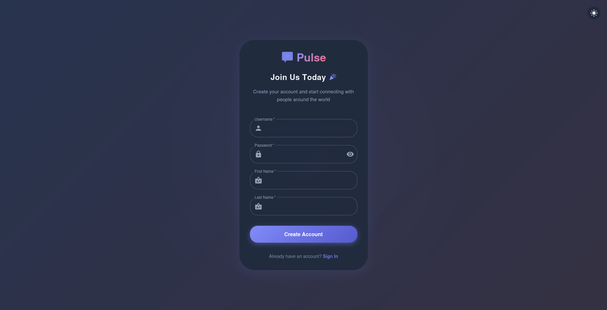
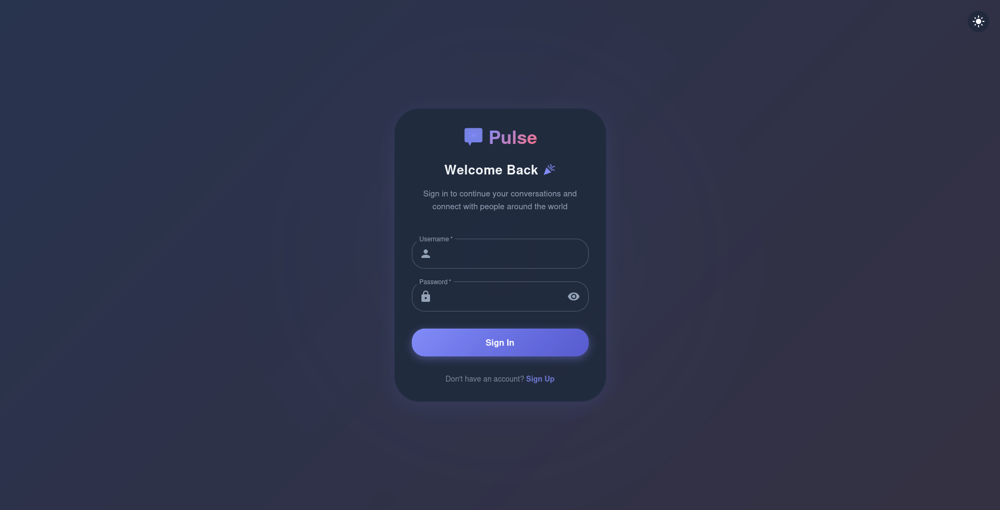
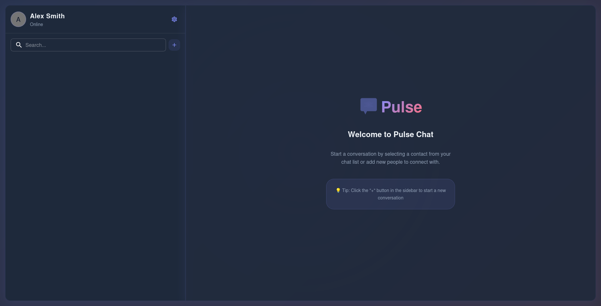
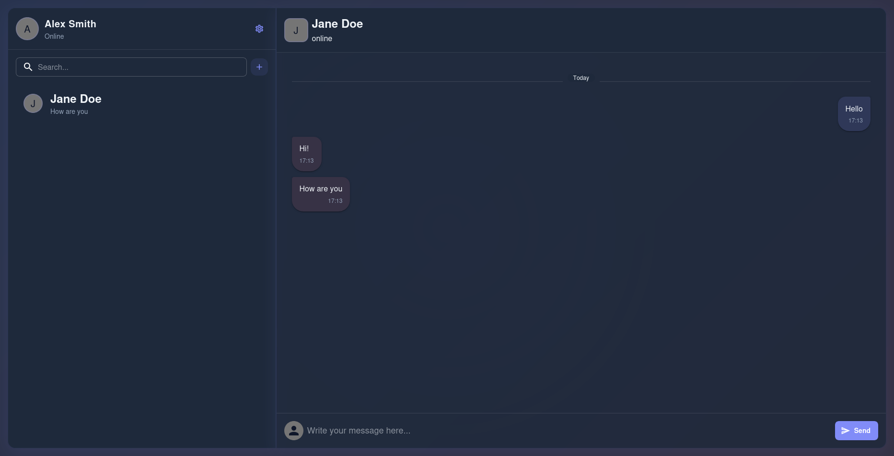
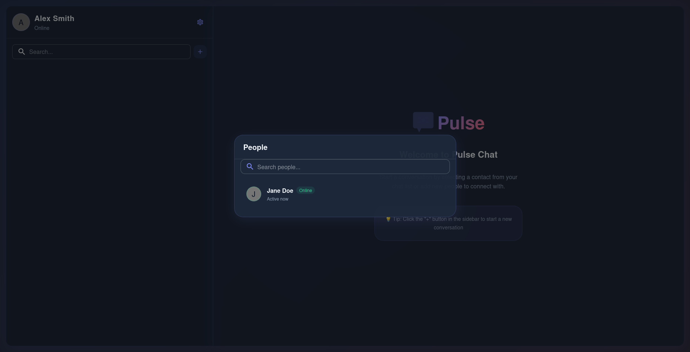
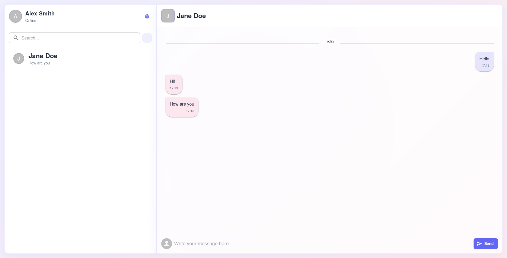

<p align="center">
  
</p>

<h1 align="center">💬 Pulse Chat</h1>

<p align="center">
  
  
  
  
  
  
  
  
</p>

---

**Pulse Chat** is a modern, simple, and real-time chat application built as a side project to showcase full-stack development skills. It features a clean Material UI design, secure authentication, and real-time messaging.

---

## ✨ Features

✅ **Real-time Messaging** — Messages delivered instantly via WebSocket.  
✅ **User Last Seen** — Displays last active time for each user.  
✅ **JWT Authentication** — Secure token-based user login.  
✅ **Password Encryption** — User passwords securely hashed.  
✅ **Modern UI** — Responsive design with Material UI + TypeScript.  
✅ **H2 In-Memory DB** — Lightweight and fast for testing/demo.

---

## 🚀 Getting Started

### Backend

> Default url is localhost:8080

```bash
cd backend
mvn clean install
mvn spring-boot:run
```

### Frontend

```bash
cd client
yarn install
yarn dev
```

> Default url is localhost:3000

---

## Screenshots

### Registration Page



### Login Page



### Welcome Page



### Messaging



### People List



### Light Theme



## 🛠️ Testing

Run All backend unit tests:

```bash
cd server
mvn test
```

---

## 🧪 Unit Test Coverage

The project includes unit tests to validate critical functionalities like user registration, login, and JWT validation.

---

## 📧 Contact

Feel free to reach out for suggestions or contributions from github issues or PR
